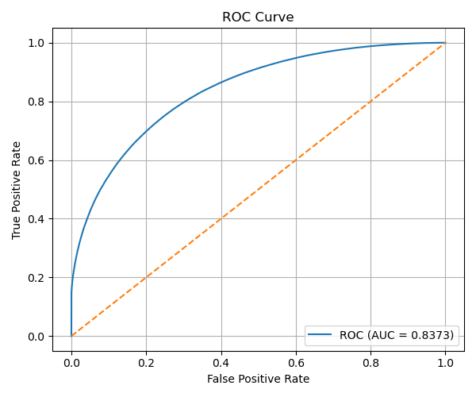
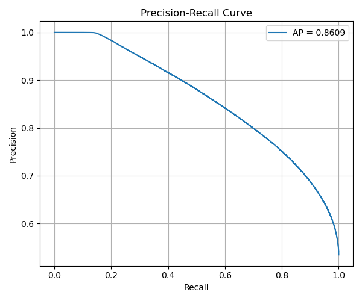
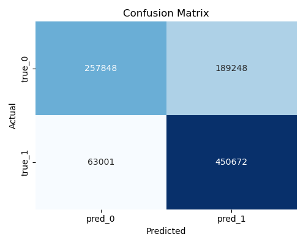
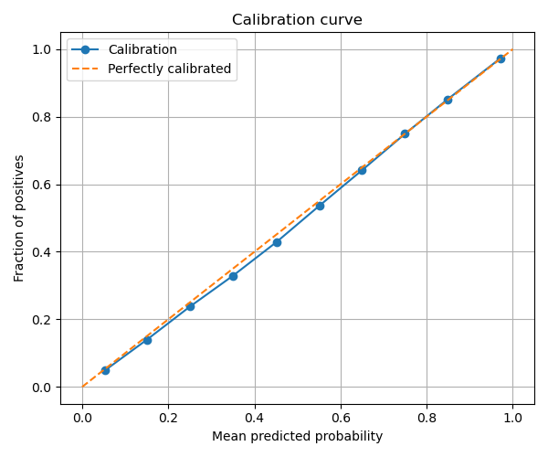
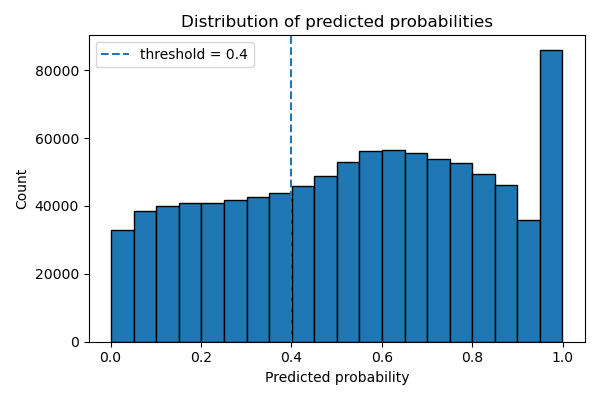

# Отчёт по проекту

**Студент:** Душейко Дарья Васильевна  
**Группа:** БИВ231

---

## 1. Введение и постановка задачи

- **Цель проекта:** предсказание вероятности возврата товара (`isReturned`) в задачe e-commerce, чтобы заранее выявлять заказы/товары/клиентов с высоким риском возврата.
- **Формулировка задачи:** бинарная классификация (`0` — не возврат, `1` — возврат).
- **Обоснование метрики качества:** в ноутбуках основная метрика обучения и сравнения — `ROC-AUC` (например, `eval_metric='AUC'` в CatBoost и метрика `roc_auc` в TabM), дополнительно считаются `F1`, `Precision`, `Recall`, `Accuracy` и `PR-AUC`.

---

## 2. Поиск и описание данных

- **Источник данных:** в репозитории присутствуют локальные `.p`-файлы в `data/raw` и `data/processed`; внешняя ссылка на исходный датасет - В качестве датасета используется набор транзакций маркетплейса с OSF https://osf.io/c793h/files/osfstorage.
- **Описание датасета (по файлам в репозитории):**
  - `data/raw/event_table_training.p`: `1,369,133 x 3` (`hash(variantID)`, `hash(customerId)`, `isReturned`)
  - `data/raw/event_table_testing.p`: `1,460,366 x 3`
  - `data/processed/customer_nodes_training.p`: `777,001 x 30`
  - `data/processed/customer_nodes_testing.p`: `825,598 x 30`
  - `data/processed/product_nodes_training.p`: `411,495 x 44`
  - `data/processed/product_nodes_testing.p`: `411,544 x 44`
- **Примеры признаков:** `yearOfBirth`, `isMale`, `shippingCountry`, `salesPerCustomer`, `returnsPerCustomer`, `customerReturnRate`, `avgGbpPrice`, `avgDiscountValue`, `salesPerProduct`, `productReturnRate`.
- **Баланс класса в event-таблицах:**
  - train: `1 -> 757,227`, `0 -> 611,906`
  - test: `1 -> 795,366`, `0 -> 665,000`

---

## 3. Обработка и подготовка данных

- **Полная очистка:** в ноутбуках выполняется подготовка фич и формирование матриц для обучения.
- **Работа с фичами:** используются табличные агрегаты по клиенту/товару и кодированные категориальные признаки; в `TABM.ipynb` используется числовая матрица с `67` признаками (`x_num`).
- **Визуализации:** в `report/` сохранены итоговые графики качества классификатора (ROC, PR, калибровка, матрица ошибок, гистограмма вероятностей).
- **Сплит данных:**
  - в `сatboost_for_returns.ipynb`: `train_test_split(..., test_size=0.2, random_state=42, stratify=y)` (также есть вариант с `test_size=0.1`);
  - в `TABM.ipynb`: последовательный сплит индексов `80/20` (trainval/test), затем внутри trainval ещё `80/20` (train/val), что даёт примерно `64/16/20`.
- **Data leakage:** явных описанных анти-утечек (кроме разделения train/val/test и `random_state`) в репозитории не зафиксировано.

---

## 4. Baseline-модель

- **Модель:** В качестве baseline-точки отсчёта использовалась оценка модели TabM со случайными весами до начала процесса обучения.
Результат Baseline: ROC-AUC: 0.5570. Данное значение лишь незначительно превышает результат случайного угадывания (0.5), что подтверждает необходимость использования сложных архитектур (CatBoost, TabM) и тщательного обучения для извлечения нелинейных зависимостей из данных TechMarket.

- **Что есть фактически:** стартовая оценка до обучения в `TABM.ipynb` — `Test before training | roc_auc=0.5570`, далее полноценное обучение модели.
- **Цель baseline:** в текущей версии проекта роль точки отсчёта выполняют ранние/упрощённые эксперименты из ноутбуков.

---

## 5. Эксперименты

Ниже только результаты, которые явно присутствуют в ноутбуках проекта.

| Модель | Гипотеза | Параметры / постановка | Результат |
|--------|----------|-------------------------|-----------|
| CatBoost (основной прогон) | Градиентный бустинг на табличных фичах должен дать сильный AUC | `iterations=1000`, `depth=6`, `learning_rate=0.05`, `eval_metric=AUC` | `ROC-AUC: 0.8390` |
| CatBoost + порог 0.4 | Подбор порога улучшит баланс precision/recall и F1 | Классификация по вероятностям с порогом `0.4` | `F1: 0.7813`, `Precision: 0.7043`, `Recall: 0.8774`, `Accuracy: 0.7375`, `PR-AUC: 0.8609` |
| CatBoost (альтернативный сценарий) | На другом наборе/настройке качество снизится | Отдельный запуск в том же ноутбуке | `ROC-AUC: 0.7016` |
| TabM | Нейросетевая табличная модель может обогнать бустинг | Обучение по эпохам на split train/val/test | `test roc_auc: 0.8418`, `f1: 0.7798`, `accuracy: 0.7563` |

---

## 6. Финальная модель и интерпретируемость

- **Обоснование выбора финальной модели (по метрикам в ноутбуках):** лучший `ROC-AUC` среди зафиксированных результатов показывает `TabM` (`~0.8418`) против CatBoost (`~0.8390`).
- **Практический артефакт в репозитории:** сохранена модель `models/catboost_model.json` (CatBoost, `Logloss`, `eval_metric=AUC`).
- **Интерпретируемость:** в `сatboost_for_returns.ipynb` есть блоки с `feature importance` и визуализацией топ-важных признаков для CatBoost.

---

## 7. Деплой

- **Интерфейс:** отдельный пользовательский интерфейс (Streamlit/бот) в репозитории не обнаружен.
- **API:** FastAPI/REST API в текущей версии проекта отсутствует.
- **Что реализовано для запуска окружения:** `Dockerfile` поднимает Jupyter Notebook на порту `8888`.

Пример запуска:

```bash
docker build -t returns-project .
docker run --rm -p 8888:8888 returns-project
```

---

## 8. Заключение и выводы

- **Итоги:** проект решает задачу бинарной классификации возвратов; зафиксированы рабочие результаты `ROC-AUC` около `0.84` на CatBoost и TabM.
- **Сравнение с baseline:** отдельный baseline-файл не выделен, но до обучения TabM показано стартовое качество `roc_auc=0.5570`, после обучения — существенный рост.
- **Ограничения:** отсутствуют явные `src`/`tests`-скрипты производственного пайплайна; часть результатов зафиксирована только внутри ноутбуков.
- **Возможные улучшения:** формализовать baseline, вынести preprocessing/training в `src`, добавить воспроизводимый evaluation-скрипт и автотесты.

---

## Графики из папки `report`

Можно увидеть графики  - notebooks/graphics.ipynb вот тут

### ROC curve


**Вывод:** Кривая ROC заметно выше диагонали (AUC ≈ 0.84): модель хорошо ранжирует транзакции по риску возврата при любом пороге — подходит для выделения групп высокого риска.

### Precision-Recall curve


**Вывод:** Высокий PR-AUC (~0.86) показывает, что при фокусе на классе «возврат» модель сохраняет высокую точность даже при умеренном дисбалансе классов.

### Confusion matrix


**Вывод:** Большая доля верных предсказаний на диагонали; при пороге 0.4 recall по возвратам выше, чем при 0.5 — бизнесу важно явно выбрать порог под цель (минимизировать пропуски возвратов vs ложные тревоги).

### Calibration curve


**Вывод:** Калибровочная кривая близка к идеальной линии — предсказанные вероятности можно интерпретировать как оценку доли возвратов без сильной перекалибровки.

### Predicted probability histogram


**Вывод:** Распределение скоров бимодально (пики около 0 и 1): модель уверенно отделяет низкий и высокий риск; оптимальный порог (~0.4) смещён относительно 0.5.

---

## Структура репозитория

```text
.
├── .github/workflows/ci.yml
├── data
│   ├── processed
│   │   ├── customer_nodes_training.p
│   │   ├── customer_nodes_testing.p
│   │   ├── event_table_training.p
│   │   ├── event_table_testing.p
│   │   ├── product_nodes_training.p
│   │   └── product_nodes_testing.p
│   └── raw
│       ├── customer_nodes_training.p
│       ├── customer_nodes_testing.p
│       ├── event_table_training.p
│       ├── event_table_testing.p
│       ├── product_nodes_training.p
│       └── product_nodes_testing.p
├── models
│   └── catboost_model.json
├── notebooks
│   ├── TABM.ipynb
│   ├── graphics.ipynb
│   ├── price_AB.ipynb
│   ├── сatboost_for_returns.ipynb
│   └── сatboost_test.ipynb
├── presentation
│   └── README.md
├── report
│   ├── calibration_curve.png
│   ├── confusion_matrix.png
│   ├── precision_recall.png
│   ├── proba_histogram.png
│   ├── roc_curve.png
│   └── report.md
├── src
├── tests
├── Dockerfile
├── requirements.txt
└── README.md
```
